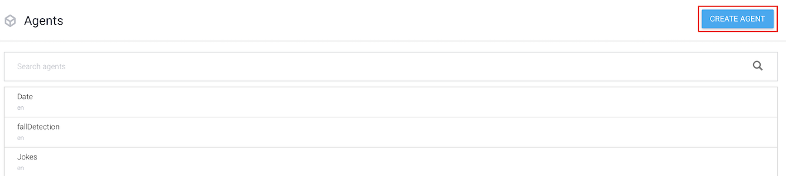

# Misty-Concierge-Template

The **Misty Concierge Template** is an open-source JavaScript skill template for Misty II robots. As a Misty developer, you can use this template to quickly build and deploy skills that put Misty to work as a concierge for your business.

The JavaScript skill templates in this repository integrate with [Dialogflow](https://dialogflow.com/) and the [Foursquare Places API](https://developer.foursquare.com/docs/api) to give Misty the ability to answer questions about nearby food, services, and places. As she listens and responds, Misty moves her head and arms, blinks her LED, plays sounds, and changes her expression to invite engagement and delight those who speak to her.

## Table of Contents

This guide provides all of the information you need to set up your Dialogflow agent, get Foursquare credentials, and update the templates for use with your own Misty II.

- [Misty-Concierge-Template](#misty-concierge-template)
  - [Table of Contents](#table-of-contents)
  - [Overview](#overview)
    - [Requirements](#requirements)
  - [Setting Up Dialogflow](#setting-up-dialogflow)
    - [Creating a Dialogflow Agent](#creating-a-dialogflow-agent)
    - [Entities](#entities)
    - [Intents](#intents)
      - [name Intent](#name-intent)
      - [aroundMe Intent](#aroundme-intent)
    - [Creating an Access Token Function](#creating-an-access-token-function)
    - [Enabling the Text-to-Speech API](#enabling-the-text-to-speech-api)
  - [Setting Up Foursquare](#setting-up-foursquare)
  - [Using the conciergeFoursquareTemplate Skill](#using-the-conciergefoursquaretemplate-skill)
    - [Updating the Skill Code](#updating-the-skill-code)
    - [Using the Meta File](#using-the-meta-file)
    - [Installing the Skill](#installing-the-skill)
    - [Customizing the conciergeFoursquareTemplate Code](#customizing-the-conciergefoursquaretemplate-code)
  - [Using the conciergeBaseTemplate Skill](#using-the-conciergebasetemplate-skill)
    - [Customizing the conciergeBaseTemplate Code](#customizing-the-conciergebasetemplate-code)
  - [Remarks](#remarks)
    - [Using Dialogflow Audio Output to Decrease Latency](#using-dialogflow-audio-output-to-decrease-latency)
  - [Contribution Guidelines](#contribution-guidelines)

## Overview

This repository includes the following resources:

* **conciergeFoursquareTemplate** - The template for a JavaScript skill that allows Misty to answer questions about nearby places, food, and services. When this skill runs, users can activate Misty with the "Hey, Misty!" wake word to ask a question. Misty moves her body and head to look at the speaker and maintain eye contact while capturing speech. She sends her recording of the question to a custom Dialogflow agent, which processes the language and returns a data structure with extracted information. Misty uses this data to request a list of recommendations from the Foursquare Places API, and parses the response into a human-readable text string that she reads out loud via Google's text-to-speech service.
* **conciergeBaseTemplate** - A stripped-down version of the concierge template. This code file provides the framework for sending audio files to (and getting data back from) a Dialogflow agent. Use this template when you want to build all of your interactions with Dialogflow and don't need another API, or when you want to use an API other than Foursquare.
* **dialogflow** - Includes a .zip file with JSON data for configuring a Dialogflow agent for use with the `conciergeFoursquareTemplate` skill.

### Requirements

To run the code in this repository, you need:

* Misty II robot running `robotVersion 1.8.4` or higher, with [2020.01.07 Android patch](https://community.mistyrobotics.com/t/2020-01-07-misty-ii-android-patch-for-improved-slam-performance/2415) applied
* Google Cloud Services account (for use with Dialogflow, Cloud Functions, and text-to-speech API)
* Foursquare developer account (for use with Places API)

Once you've created your Dialogflow agent and a Foursquare app, you can update the code in the JavaScript skill template files with your credentials. Read on to get started!

***Note:** Some of the commands and event types used in these templates are **beta**, and related hardware, firmware, and software is still under development. Please recognize that these skills may behave unpredictably at this time, and their range of capabilities is likely to change as Misty improves. If you have questions about getting started, or if you run in to issues with the contents of this repository, we encourage you to [post in the Misty Community Forums](https://community.mistyrobotics.com/t/application-template-misty-as-a-concierge/2414)!*

## Setting Up Dialogflow

The templates in this repository use Dialogflow to handle voice interactions between information seekers and your Misty II robot. Each template also uses Google's text-to-speech service to create replies that Misty can "speak" out loud. This section describes how to create your own Dialogflow agent for use with the templates in this repository, and provides instructions for creating a cloud function that generates tokens for accessing Google services from your skill code.

To use Dialogflow with the Misty Concierge Template, we must create a Dialagflow *agent*. Dialogflow agents include *intents* and *entities*. In natural language processing (NLP), *intents* are categories of expression that users provide to interact with your application in different ways. *Entities* can be thought of as values that your Dialogflow agent can understand and extract from the expressions your users provide. You can read more about [agents](https://cloud.google.com/dialogflow/docs/agents-overview), [intents](https://cloud.google.com/dialogflow/docs/intents-overview), and [entities](https://cloud.google.com/dialogflow/docs/entities-overview) in the Dialogflow developer documentation. 

For ease of getting started, this repository includes a set of data files you can import to a Dialogflow agent to create intents and entities that are pre-configured for use with the concierge template. The next section describes how to set this up.

### Creating a Dialogflow Agent

To create a Dialogflow agent with some basic intents and entities for use with the Misty Concierge Template:

1. Clone or download this repository to your computer. 
2. [Create a Dialogflow account](https://dialogflow.com/) (this template uses the free "Standard" edition of Dialogflow) and log in.
3. Click **Create Agent.** <br> 
4. Give the agent a name and click **Create**. You can use any name you like. <br> 
5. When the agent is ready, click the **settings** icon next to its name. <br> 
6. Select **Export and Import** from the top menu on the settings page. <br> 
7. Click **Import from Zip**, and follow the instructions on screen to upload the `concierge.zip` file (located in the `dialogflow` directory of this repository). <br> 
8. Copy the **Project ID** from the settings page to a separate note, so you can use it in your skill code later on. <br> 

The `concierge.zip` file includes several JSON files with metadata about intents and entities that are pre-configured to work with the template files in this repository. When you upload the `concierge.zip` file, Dialogflow uses this metadata to add these intents and entities to your agent.

The rest of this section provides a high-level description of how the agent works. Feel free to skip ahead, and come back when you need more detail.

### Entities

The pre-configured entities include `food`, `services`, and `places`. 


If you select an entity, you can see all of the *reference values* and *synonyms* associated with that entity. When the Dialogflow agent identifies a reference value (or one of its synonyms) in a user expression, it extracts that value and returns it to your application as a *parameter* of a given intent. You can customize your agent by adding reference values to the existing entities, or by creating new entities of your own. 

For example, the `food` entity includes reference values like `burger`, with synonyms like *cheese burger* and *hamburger*.


***Note:** Dialogflow also provides several **system entities** for common values like `date`, `time`, and `location`. You can see the [full list of system entities in the Dialogflow documentation](https://cloud.google.com/dialogflow/docs/reference/system-entities).*

### Intents

Next, let's look at the pre-configured intents. This agent includes the custom intents `aroundMe` and `name`.


#### name Intent

The `name` intent handles questions about Misty's name. It includes a handful of *training phrases* (for example, "What's your name?" and "What are you called?"), as well as a *response* ("My name is Misty!"). When the agent associates a user expression with this intent, it returns this response to the skill and Misty speaks this text string out loud.


***Note:** Training phrases are example expressions that map to a given intent. Dialogflow uses these phrases to train the NLP model for your agent, so your users don't have to speak a training phrase exactly in order to activate the correlated intent. It's a good practice to provide training phrases that model a variety of ways a user could ask a question.*

#### aroundMe Intent

The `aroundMe` intent is the core of the Misty Concierge Template. This intent is trained to recognize questions about services, food, and places nearby. 


Take a look at the highlighted word in each training phrase. This annotation identifies the placement of important information in each sentence. When you add a new training phrase, you can highlight words with information relevant to your application. Tag these words with the appropriate entity and parameter name. 


We define parameters (and the entities with which they are associated) in the **Action and parameters** section on the intent page.


***Note:** See the Dialogflow documentation for [more on annotating training phrases](https://cloud.google.com/dialogflow/docs/intents-training-phrases).*

With the Dialogflow agent set up, we're ready to create a cloud function for generating the unique Access Token.

### Creating an Access Token Function

The skill templates in this repository need a unique Access Token to access your Dialogflow agent and Google's text-to-speech API. By default, a Google Access Token is only valid for about an hour. To prevent the need for updating your skill code with a new token each time you run a skill, we create a Google Cloud Function to return a new Access Token on demand. Each time the template skill runs, it sends a request to trigger this function, so we are always using fresh credentials. What's more, in cases where the skill runs for more than an hour, it sends periodic requests to refresh the token, so you don't lose access in the middle of a session.

Follow these steps to set up the cloud function:

1. Click the settings icon for your Dialogflow agent.


2. Click the link next to the Project ID to open the Google Cloud console for the project. <br> 
3. Select **Cloud Functions** from the **Compute** menu in the left navigation. (If you do not already have a Google Cloud Platform account, you may be prompted to create a free trial account.) <br> 
4. Click **Create Function**. <br> 
5. Name the function **authToken**, and set the memory allocation to 128 MB.
7. Copy the following into the `index.js` and `package.json` editors: 

For `index.js`:
```js
const {GoogleAuth} = require('google-auth-library');

exports.getAuthToken = (req, res) => {

  const auth = new GoogleAuth({
    scopes: 'https://www.googleapis.com/auth/cloud-platform'
  });

  const accessToken = auth.getAccessToken().then(responses => {
    console.log(`  AccessToken: ${responses}`);
    var jsonResult = {
      "authToken" : responses
    };

    res.status(200).send(jsonResult);
  });

};
```

For `package.json`:

```json
{
  "name": "authToken",
  "version": "0.0.1",
  "dependencies": 
  {
    "google-auth-library" : "^5.2.0"
  }
}
```

7. Set the **Function to execute** to `getAuthToken`. Your page should look something like this: <br> 
8. Click **Create**. It may take a few seconds to process.
9. Copy the trigger URL for the function to a separate note, so you can use it in your skill code. Find this URL by clicking the name of your function on the Cloud Functions page. Then choose **Trigger** from the top menu. <br> 

### Enabling the Text-to-Speech API

The last step in configuring the Google project is to enable the text-to-speech API. Follow these steps to do so:

1. Open the left menu of the Google Cloud Platform console for your project and select **APIs & Services** &rarr; **Library**. <br> 
2. Search for **text-to-speech** and select **Cloud Text-to-Speech API** from the search results. <br> 
3. Click **Enable**. <br> 

There you have it! The Dialogflow agent is set up, the cloud function is ready to go, and the text-to-speech API is enabled. Here's what's next:

* If you're using the `conciergeFoursquareTemplate`, head to the next section of this guide. (If you're not sure where to go from here, this option is probably what you want.)
* If you're *not* using Foursquare, skip to the section titled [Using the conciergeBaseTemplate Skill](#using-the-conciergeBaseTemplate-skill).
  
## Setting Up Foursquare

The `conciergeFoursquareTemplate` skill uses data you get back from Dialogflow to request a list of recommended places from the [Foursquare Places API](https://developer.foursquare.com/docs/api). It converts these results into a human-understandable text string, and uses the Google text-to-speech API to have Misty read the results out loud. 

In this template, Misty gets a list of places by sending a request to the [Get Venue Recommendations](https://developer.foursquare.com/docs/api/venues/explore) operation. All operations in the Places API require a Client ID and a Client Secret. Follow these steps to create an app on Foursquare and generate credentials for the template:

1. [Sign up](https://foursquare.com/developers/signup) for a Foursquare account.
2. In the **My Apps** console, select **Create New App**. <br> 
3. Give your app a name and a URL. These can be anything you like. Click **Next.** <br> 
4. Copy the **CLIENT ID** and **CLIENT SECRET** to a separate note. We use these strings to update the `conciergeFoursquareTemplate` skill code. <br> 

Okay! We have the Foursquare keys, and each service is configured to work with the templates in this repo. Now we can update the skill code, generate a meta file, and install the skill on Misty!

## Using the conciergeFoursquareTemplate Skill

The `conciergeFoursquareTemplate.js` file in this repo contains the JavaScript code for running the concierge skill. The logic for Misty's behavior is predefined in this template, and includes:

* On hearing the "Hey, Misty" wake word, Misty captures a speech recording and sends it to the Dialogflow agent.
* Dialogflow parses the expression and returns the intent and parameters of the request.
* Misty parses the response data and sends another request to the **Get Venue Recommendations** operation in the Foursquare Places API.
* Misty converts the recommendations in the response from the Places API to a human-understandable text string, which she then reads aloud via with Google's text-to-speech service.
* The template includes a handful of event loops that give the interaction a lifelike quality. Misty uses facial recognition to maintain eye contact with the person who asked the question, and she uses audio localization to turn her body in the direction of their voice. 
* Once Misty has spoken the reply, she starts listening for the wake word so you can ask another question. 

These behaviors are already coded into the skill template. All you need to do is update the template with the Project ID for your Dialogflow agent, the URL for your cloud function, the Client ID and Secret for your Foursquare application, and your latitude/longitude coordinates. Then you can generate the meta file for your skill and install it on your robot.

### Updating the Skill Code

Open the `conciergeFoursquareTemplate.js` file in a text editor. You should see the following lines of code at the top of the file:

```js
// ============================= Set Your Credentials Here ================================

misty.Set('cloudFunctionAuthTokenURL', "YOUR_TRIGGER_URL_TO_GOOGLE_CLOUD_FUNCTION_THAT_PROVIDES_ACCESS_TOKEN", false);
misty.Set("GoogleCloudProjectID", "YOUR_GOOGLE_CLOUD_PROJECT_ID", false);
misty.Set("langCodeForTTS", "en-US", false);

misty.Set("fourSq_ClientID", "YOUR_FOURSQUARE_CLIENT_ID", false);
misty.Set("fourSq_ClientSecret", "YOUR_FOURSQUARE_CLIENT_SECRET", false);
misty.Set("latituteLongitude", "40.023133,-105.245877", false); // UPDATE YOUR LATITUDE AND LONGITUDE COORDINATES
misty.Set("numberOfResults", "3", false);

// =========================================================================================

```

Update this code as follows: 

1. Set `"YOUR_TRIGGER_URL_TO_GOOGLE_CLOUD_FUNCTION_THAT_PROVIDES_ACCESS_TOKEN"` to the URL for your cloud function trigger.
2. Set `"YOUR_GOOGLE_CLOUD_PROJECT_ID"` to the Project ID for your Dialogflow agent.
3. Set `"YOUR_FOURSQUARE_CLIENT_ID"` to the Client ID for your Foursquare app.
4. Set `"YOUR_FOURSQUARE_CLIENT_SECRET"` to the Client Secret for your Foursquare app.
5. Set `"40.023133,-105.245877"` to the latitude and longitude for your location. You can use a resource like https://www.latlong.net/ to get the coordinates for different locations.
6. **Optional:** Change the [language code for the text-to-speech API](https://cloud.google.com/text-to-speech/docs/voices) (set in the template to `"en-US"`) to have Misty speak in a different language.
7. **Optional**: Modify the value for `numberOfResults` to change how many recommendations Misty gets from the Places API. 
8. Save your changes.

### Using the Meta File

In addition to your code file, each JavaScript skill you upload to Misty requires a JSON meta file that configures some of the initial settings and parameters that determine how Misty runs the skill code. Each template in this repository includes a pre-made meta file, so there's no need to generate your own unless you'd like a meta file that's associated with a unique GUID. For information about the key/value pairs defined in the meta file, see the [Meta File documentation](https://docs.mistyrobotics.com/misty-ii/javascript-sdk/javascript-skill-architecture/#meta-file).

### Installing the Skill

Follow these steps to install the skill on Misty:

1. Open the [Skill Runner](http://sdk.mistyrobotics.com/skill-runner/) web page and enter Misty’s IP address in the **Robot IP Address** field (located in the upper right hand corner). Click **Connect**.
2. Make sure **JavaScript** is selected in the **Install** section. Then click **Choose files** and navigate to the directory with the `conciergeFoursquareTemplate` code and meta files. Select both files and click **Open**.
3. When the upload is complete, the skill appears in the **Manage** section of the Skill Runner page. Find it and click **Start** to begin execution. 

***Note:** The Skill Runner web page prints debug messages from running skills to your browser's web console. These messages can help you troubleshoot when things don't work as expected. Open the console with **Ctrl + Shift + J** (Windows/Linux) or **Cmd + Option + J** (Mac).*

### Customizing the conciergeFoursquareTemplate Code

To expand on the functionality of this template, you can create additional intents in your Dialogflow agent for handling other categories of expression. Then, you must update the skill code with additional logic that describes how Misty should respond to each new intent.

In the `conciergeFoursquareTemplate.js` file, the logic that handles the response from Dialogflow is placed inside the `_dialogueFlowResponse()` callback function. Take a look at how this function handles the current intents to get ideas for how you might handle other questions and responses. The possibilities are endless!  

## Using the conciergeBaseTemplate Skill

The `conciergeBaseTemplate.js` skill lays the foundation for a skill that captures speech, sends it to a Dialogflow agent, and handles the agent's response. You can customize this template to handle the logic for any intents and parameters you like. This template a good place to start when you want to define all of Misty's responses in your Dialogflow agent, rather than having the robot call out to another API. (For an example of how you might do this, see the [`name` Intent](#name-intent) section of this article.) It is also useful when you want to incorporate the response from Dialogflow into requests to an API other than Foursquare.

### Customizing the conciergeBaseTemplate Code

You must update the `conciergeBaseTemplate` skill with the Project ID for your Dialogflow agent and the URL for your cloud function. Open the `conciergeBaseTemplate.js` file from your local copy of this repository in a text editor. You should see the following lines of code at the top of the file:

```js
// ============================= Set Your Credentials Here ================================

misty.Set('cloudFunctionAuthTokenURL', "YOUR_TRIGGER_URL_TO_GOOGLE_CLOUD_FUNCTION_THAT_PROVIDES_ACCESS_TOKEN", false);
misty.Set("GoogleCloudProjectID", "YOUR_GOOGLE_CLOUD_PROJECT_ID", false);
misty.Set("langCodeForTTS", "en-US", false);

// =========================================================================================
```

Update this code as follows:

1. Set `"YOUR_TRIGGER_URL_TO_GOOGLE_CLOUD_FUNCTION_THAT_PROVIDES_ACCESS_TOKEN"` to the URL for your cloud function trigger.
2. Set `"YOUR_GOOGLE_CLOUD_PROJECT_ID"` to the Project ID for your Dialogflow agent.
3. **Optional:** Change the [language code for the text-to-speech API](https://cloud.google.com/text-to-speech/docs/voices) (set in the template to `"en-US"`) to have Misty speak in a different language.
4. Save your changes.
 
If you use the base template with the Dialogflow agent from this guide, then Misty responds to different questions by speaking the default response associated with each intent. To modify Misty's response, you must customize your Dialogflow agent by creating other intents. You can then update the logic for handling response data from Dialogflow in your skill code. This logic is placed inside the `_dialogueFlowResponse()` callback function. Customize this callback to modify Misty's response to different intents and parameters.

When you're ready to run the skill, [generate a meta file](#generating-the-meta-file) and [install the skill on your Misty II](#installing-the-skill).

## Remarks

### Using Dialogflow Audio Output to Decrease Latency

In these templates, we have Misty speak out loud by sending the response from Dialogflow (or the parsed response from Foursquare) to Google's text-to-speech API. It's worth noting that each Dialogflow response can include audio output of the response phrase, so that Misty can save and play back the Dialogflow response without sending an additional request to the text-to-speech service. Each template includes an example of how to do this.

Uncomment lines 405 - 413 in the `conciergeFoursquareTemplate`, or 352 - 355 in the `conciergeBaseTemplate`, and comment out calls on the `speakTheText()` method that simply send the response from Dialogflow to Google's text-to-speech service. This can decrease latency when you just need Misty to read the default response from Dialogflow.

***Note:** This doesn't work with the response from Foursquare, because that response does not include base64-encoded audio output.*

You can configure the settings for the audio output that Dialogflow returns by changing the values for the [`outputAudioConfig`](https://cloud.google.com/dialogflow/docs/reference/rest/v2beta1/OutputAudioConfig) object in the body of your Dialogflow request. In the `conciergeFoursquareTemplate`, these arguments are defined on line 337:

```js
    var arguments = JSON.stringify({
        "queryInput": {
            "audioConfig": {
                "audioEncoding": "AUDIO_ENCODING_LINEAR_16",
                "languageCode": "en-US"
            }
        },
        "inputAudio": base64,
        "outputAudioConfig": {
            "audioEncoding": "OUTPUT_AUDIO_ENCODING_LINEAR_16",
            "synthesizeSpeechConfig": {
                "speakingRate": 0.95,
                "pitch": 0,
                "volumeGainDb": 0,
                "effectsProfileId": ["handset-class-device"],
                "voice": {
                    'name': "en-US-Wavenet-F"
                }
            }
        }
    });
```


## Contribution Guidelines

Want to help this project grow? The Misty community would love your contributions! If you'd like to work on open issues, improve this documentation, add examples built on other services, or have ideas for other ways to advance the project, we hope you'll submit a pull request. To learn more about the technologies used in this project, check out these resourcese:

* [Misty II JavaScript SDK docs](https://docs.mistyrobotics.com/misty-ii/javascript-sdk/javascript-skill-architecture/)
* [Dialogflow docs](https://cloud.google.com/dialogflow/docs/)
* [Foursquare Places API docs](https://developer.foursquare.com/docs/api)

New to contributing to open source? Here's how you can get started with this
project.

* [Fork this repository](https://guides.github.com/activities/forking/).
* Clone the forked repo to your local machine: `git clone https://github.com/<github-username>/misty-concierge-template.git`
* Create a branch to work on your changes: `git checkout -b <branch-name>`
* Test your changes and [submit a pull request](https://help.github.com/en/github/collaborating-with-issues-and-pull-requests/creating-a-pull-request-from-a-fork). Include a description of your changes. If your PR relates to an open issue, be sure to reference the issue in the description.
* Wait for your changes to be reviewed and work with the community to get it approved!

If you have questions about contributing to this project, please share them in the [Misty Community Forums](https://community.mistyrobotics.com/t/misty-application-template-misty-concierge-template/2414). We are excited to see how the project grows!
